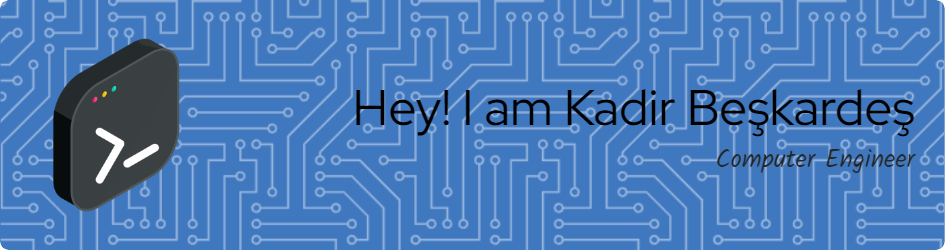

  
  # Hi there, I'm Kadir Beşkardeş 👋
  
  ### 💻 Full Stack Developer | .NET Enthusiast | Problem Solver

  

    I am a passionate Computer Engineer specializing in building user-friendly, modern, and high-performance applications.  
    My focus lies in the <b>.NET Ecosystem</b>, <b>React Native</b>, and <b>AI-Powered Solutions</b>.
  

  

    
    
    
  

---

### 🚀 About Me

I hold a degree in **Computer Engineering** from Kırıkkale University and am currently pursuing studies in **Management Information Systems** at Anadolu University.

Currently working as a Freelance Web Developer at **Deluxe Digital Solutions**, I craft scalable solutions for real-world problems. In my development process, I prioritize not just writing code, but delivering excellent **User Experience (UX)** and adhering to **Clean Architecture** principles.

---

### 🛠️ Tech Stack

| **Backend & .NET** | **Mobile & Frontend** | **Database & Cloud** |
| :--- | :--- | :--- |
|   |   |   |
|   |   |   |

---

### 🏆 Featured Projects

#### 🌟 Flagship Projects

| Project | Description | Key Tech |
| :--- | :--- | :--- |
| **[Testival 🏆](YOUR_LINK_HERE)**   _Sep 2025_ | **Tournament & Quiz Platform.** A Full-Stack application where users can create interactive tournaments and quizzes. Supports PWA for seamless mobile experience. | `.NET 8`, `React Native`, `Azure`, `JWT` |
| **[Kitabika 📚](YOUR_LINK_HERE)**   _Jun 2025_ | **Book Management & E-Commerce.** A modern web platform featuring a role-based admin panel, shopping cart system, and advanced catalog management. | `.NET 9`, `EF Core`, `AutoMapper`, `Identity` |

#### 📱 Mobile & AI Solutions

| Project | Description | Key Tech |
| :--- | :--- | :--- |
| **[Vision Assistant 👁️](YOUR_LINK_HERE)**   _Dec 2023_ | **AI-Powered Visual Recognition.** A social interaction app that analyzes the environment and provides audio descriptions for visually impaired users. | `Xamarin`, `Azure Vision`, `OpenAI GPT-3.5` |
| **[Steganography App 🔐](YOUR_LINK_HERE)**   _May 2024_ | **Data Hiding & Encryption.** A desktop security tool capable of hiding text or images within other image files using LSB algorithms. | `Python`, `LSB Algo`, `Blowfish`, `Tkinter` |
| **[GrinGrid 💬](YOUR_LINK_HERE)**   _Jan 2023_ | **Real-Time Chat App.** A cross-platform messaging application supporting instant file sharing and secure communication. | `Xamarin`, `Firebase Realtime DB` |

#### 🛠️ Other Tools

* **Remind Me (Dec 2022):** Medication tracking and patient control system with video proof. *(Xamarin, Firebase Storage)*
* **Spell Checker (May 2024):** A desktop tool using NLP techniques and edit distance algorithms for text correction. *(Python, Tkinter)*

---

   
  <h3>🚀 Ready to see more?</h3>
  
Explore detailed case studies, live demos, and documentation on my personal portfolio.

  
  

